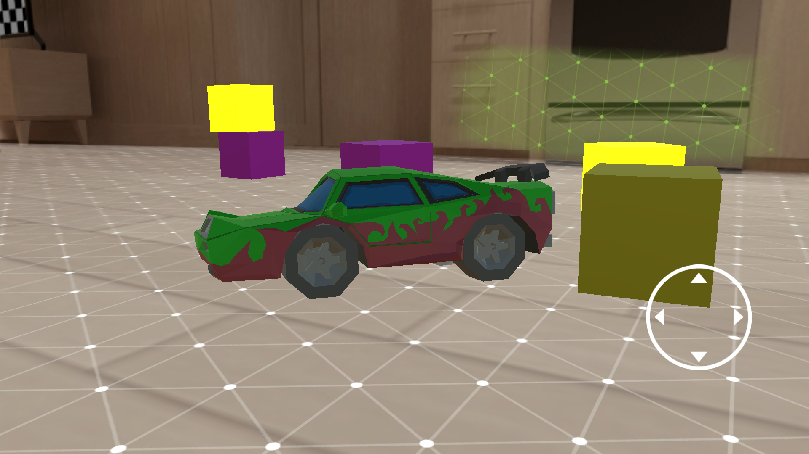
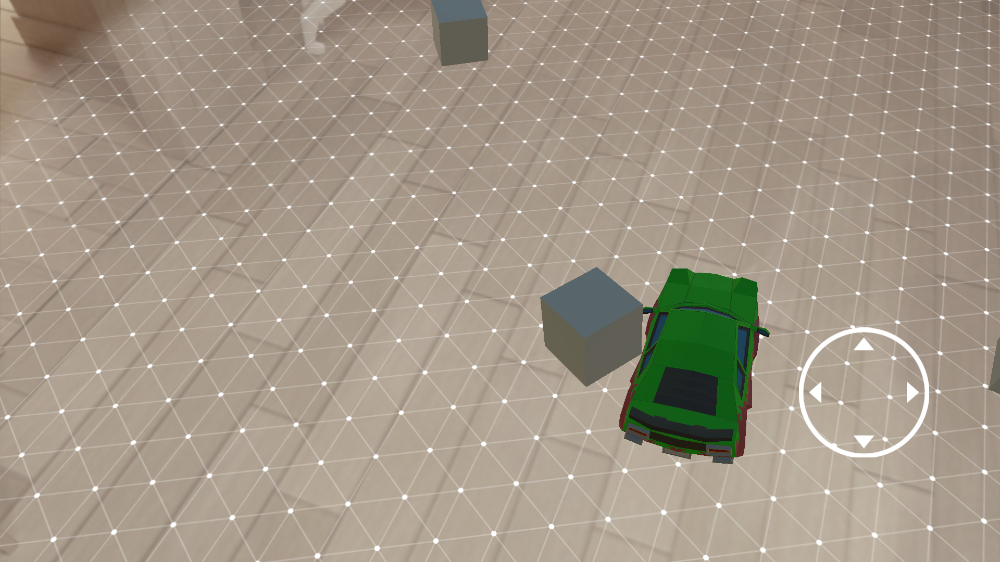
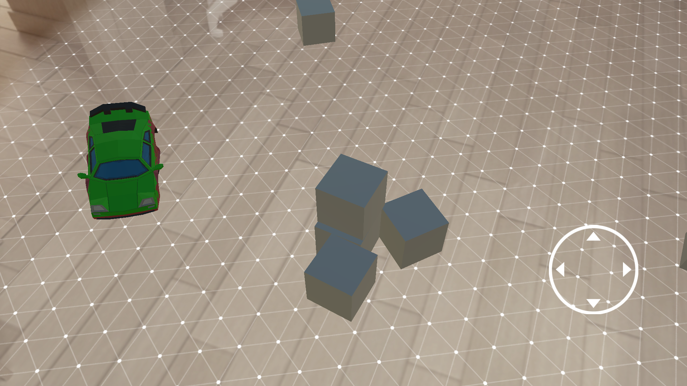
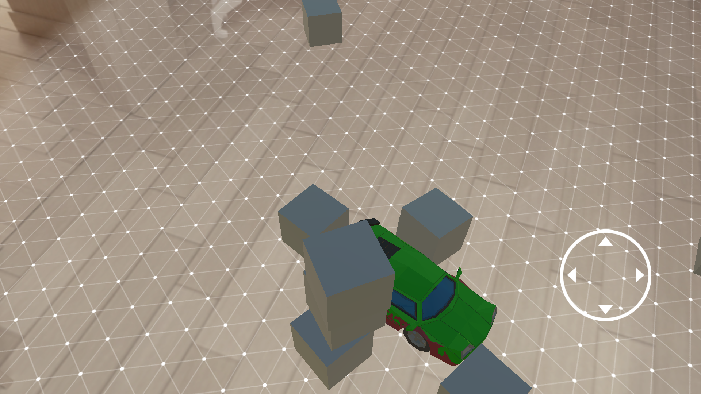
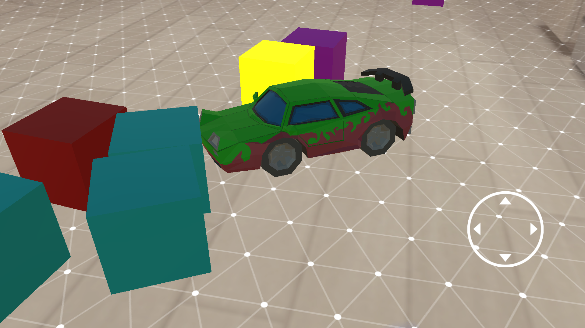
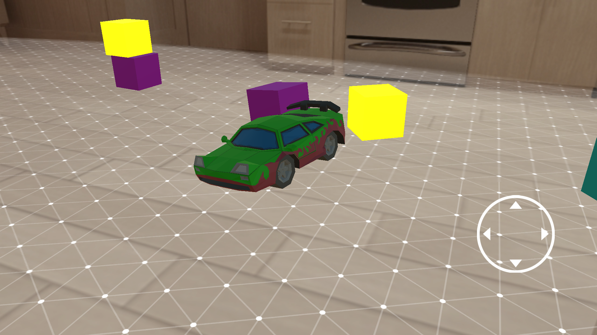

# ARCore -- Remote Control Car Simulation

Android App built using ARCore by Google for providing the feel of driving a Remote Control Car in Real World.

# Getting Started
 - Clone this repo:
    ```sh
    $ git clone https://github.com/ADItyaP999/ARCore--RemoteControlCar-Simulation.git
    ```
 - Open the project in [Unity.](https://unity.com/)
 - Change Build Settings to Android and give proper Android SDK path

 ## Sample Android App 
 
  - [ARCore Remote Control Car Simulator.apk](Android%20APK%20Build/AR%20Core%20Remote%20Control%20Car%20Simulation%20-%20Version%201.apk)

## Features
  - Easy to Install
  - Custom Controls
  - Code Can be updated according to need.

And of course this Project itself is open source with a [public repository](https://github.com/ADItyaP999/ARCore--RemoteControlCar-Simulation.git)
 on GitHub.

### Requirements for Improving the Remote Control Car 

In this Project certain Apps and Packages are required to upgrade:

* [Unity](https://unity.com/) - Game Development Platform
* [ARCore - Unity SDK Package](https://github.com/google-ar/arcore-unity-sdk/releases/tag/v1.9.0/) - SDK for importing ARCore packages
* [Android SDK 7.0 (API Level 24) or later](https://developer.android.com/studio) - Required for Android APP Build Purpose. 
* And Last but not Least an ARCore Supported Device for Testing. Check the list of [Supported Devices.](https://developers.google.com/ar/discover/supported-devices)

### Snapshots


<p float="left">


</p>
<p float="left">


</p>
<p float="left">


</p>
